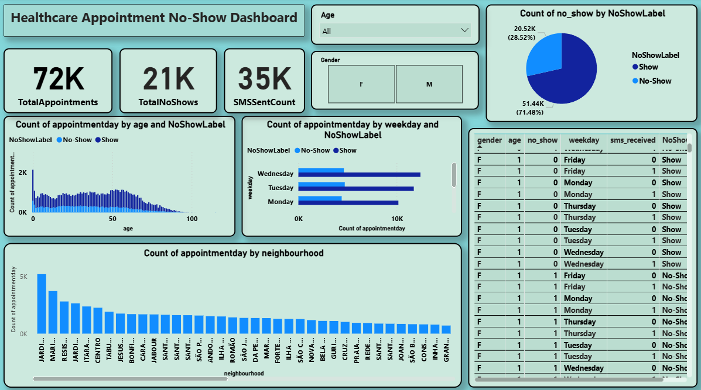

# 🏥 Healthcare No-Show Appointments Prediction

This project analyzes and predicts patient no-shows in medical appointments using a real-world dataset. It includes a machine learning model and an interactive Power BI dashboard for insights.

---

## 📂 Project Structure

```
project2-healthcare/
│── KaggleV2-May-2016.csv
│── cleaned_appointments_for_powerbi.csv
│── healthcare_no_show_prediction.ipynb
│── no_show_dashboard.pbix
│── dashboard_preview.png
│── report.pdf
│── README.md
```

---

## 🎯 Objectives

- **Predict** whether a patient will miss an appointment.
- **Analyze patterns** based on age, gender, SMS reminders, and weekdays.
- **Optimize** clinic scheduling and reminder strategies.

---

## 🛠 Technologies Used

- **Python**: Pandas, Scikit-learn (for data cleaning & modeling)
- **Power BI**: Dashboard visualizations

---

## 📊 Dashboard Insights

- **KPI Cards**: Total Appointments, No-Shows, SMS Sent Count
- **Charts**:
  - Age vs No-Show (stacked column)
  - Weekday vs No-Show (bar chart)
  - Neighborhoods distribution (bar chart)
  - Show vs No-Show (pie chart)
- **Filters**: Gender, Age, Weekday, SMS reminders, No-Show label
- **Patient Details Table**

---

## 🤖 Machine Learning Model

- **Algorithm**: Decision Tree Classifier
- **Target**: `no_show` (0 = Show, 1 = No-Show)
- **Model Accuracy**: 71%

---

## 📷 Dashboard Preview



---

## 📑 Report Summary

Refer to `report.pdf` for:
- **Dataset insights**
- **Data cleaning steps**
- **Model evaluation**
- **Dashboard explanations**

---

## 🚀 Running the Project

1. Open `healthcare_no_show_prediction.ipynb` in Jupyter Notebook.
2. Run all cells to clean the data and train the model.
3. Load `cleaned_appointments_for_powerbi.csv` into Power BI.
4. Open `no_show_dashboard.pbix` to explore the dashboard.

---

